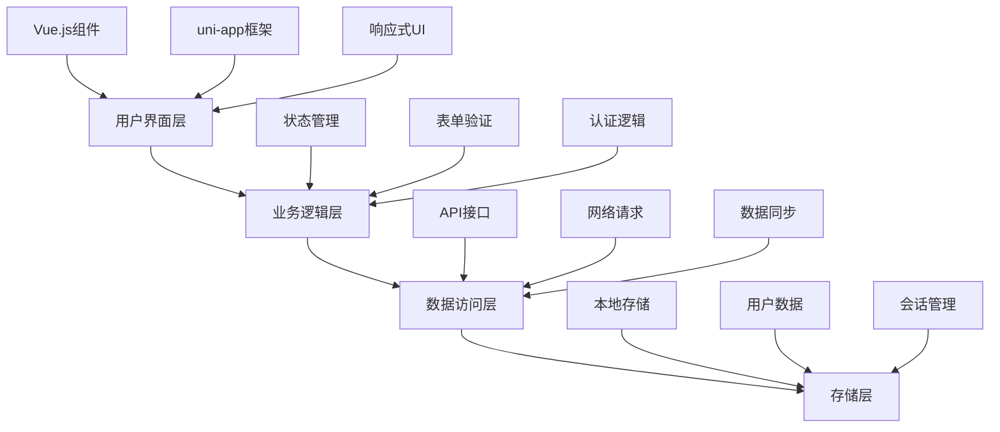
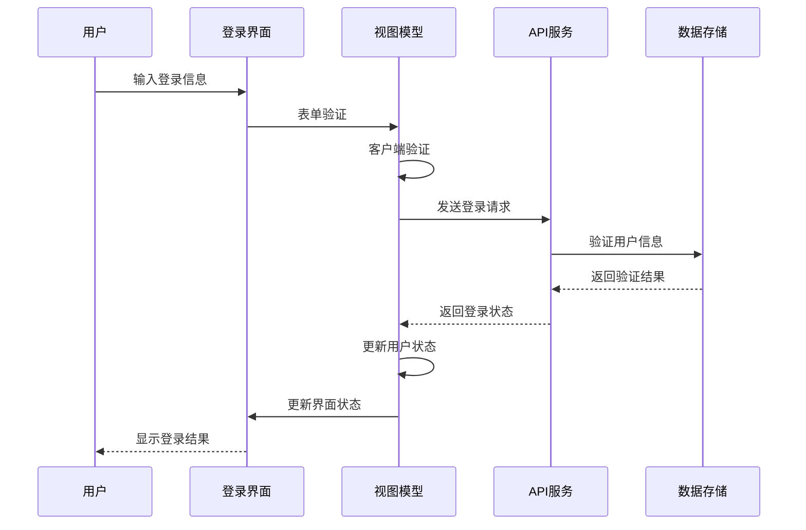
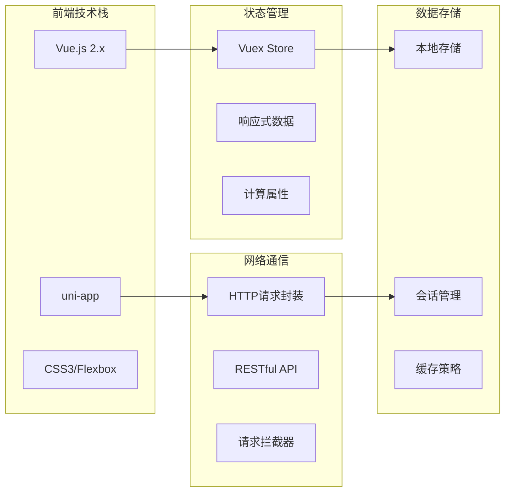
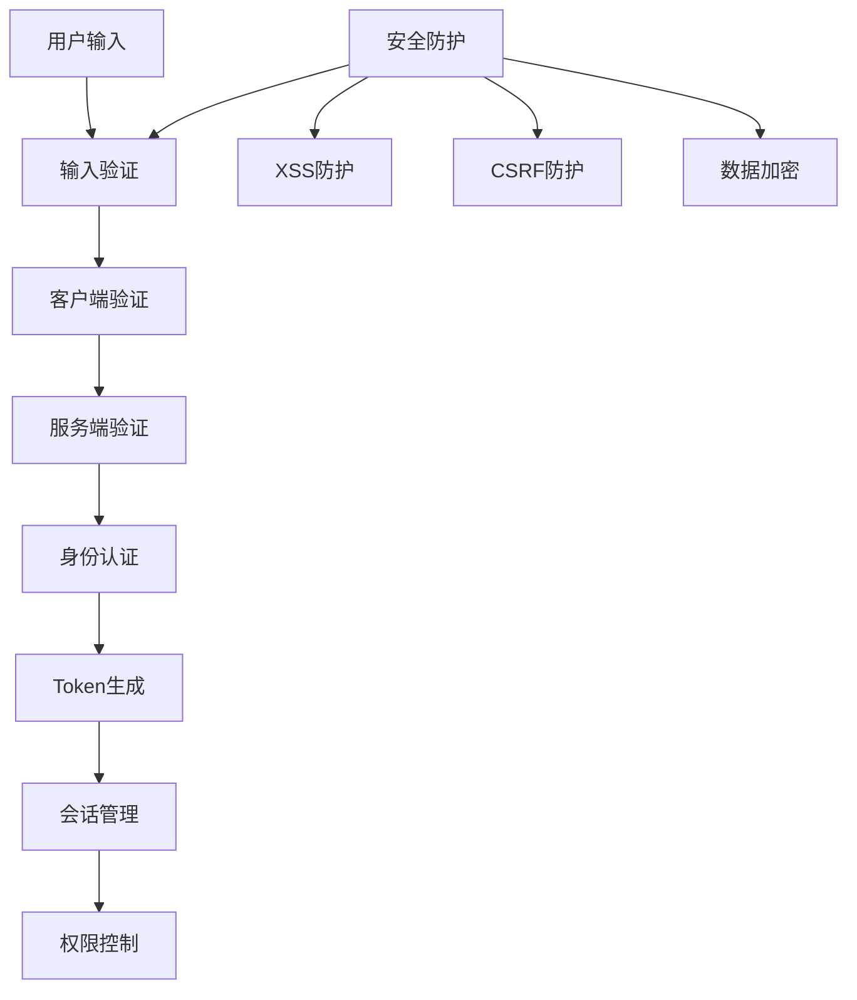
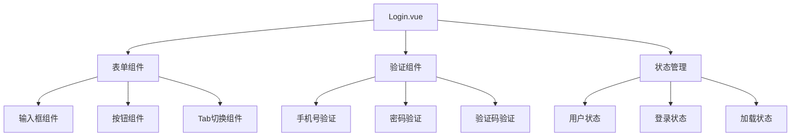
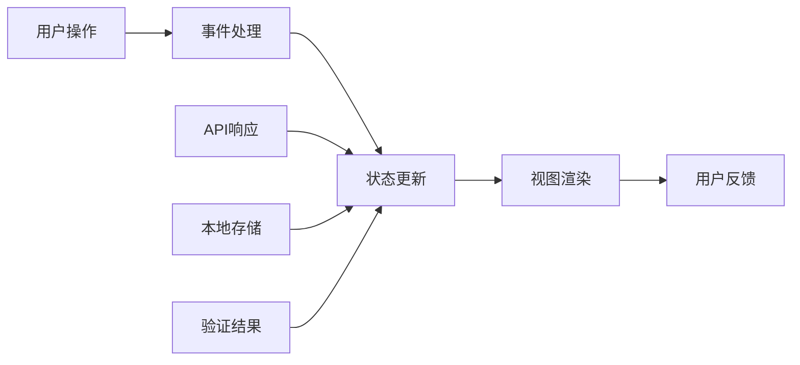
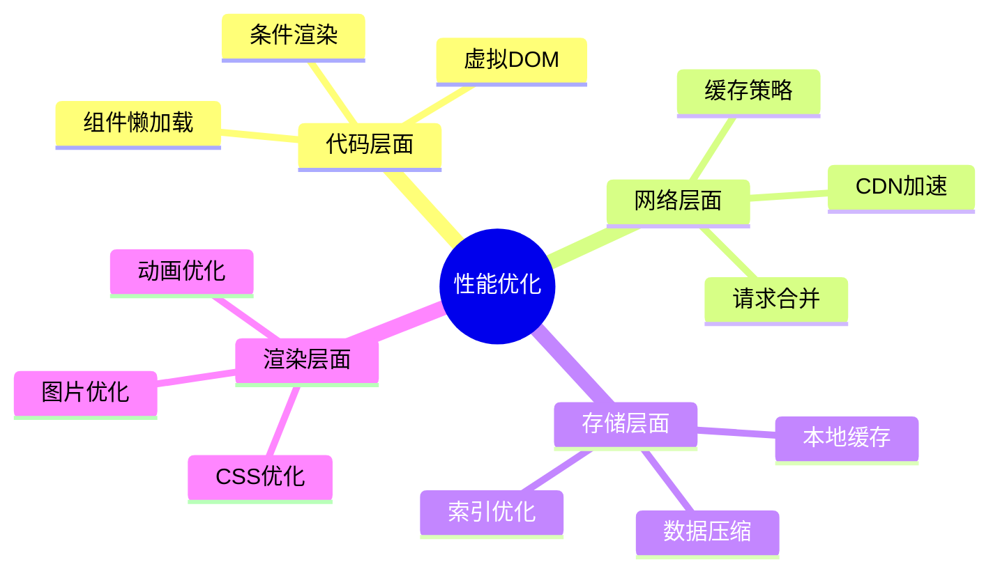
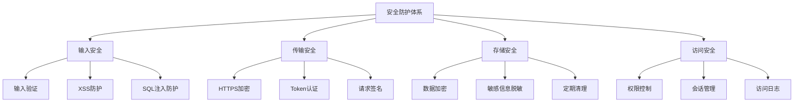
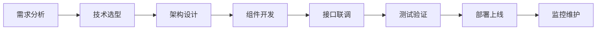
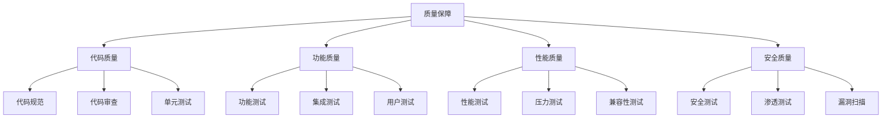

# 登录页面技术架构模型 - PPT展示版

## 1. 整体技术架构图

## 2. 登录流程架构图

## 3. 技术栈分层架构

## 4. 安全机制架构图

## 5. 组件架构图

## 6. 数据流架构图

## 7. 技术特性矩阵

| 技术领域 | 核心技术 | 实现方式 | 业务价值 |
|---------|---------|---------|---------|
| 前端框架 | Vue.js 2.x | 组件化开发 | 提高开发效率 |
| 跨平台 | uni-app | 一套代码多端 | 降低维护成本 |
| 状态管理 | Vuex | 集中状态管理 | 数据一致性 |
| 网络通信 | HTTP封装 | 统一请求处理 | 提高稳定性 |
| 安全防护 | 多重验证 | 客户端+服务端 | 保障数据安全 |
| 用户体验 | 响应式设计 | 自适应布局 | 提升用户满意度 |

## 8. 性能优化策略图

## 9. 安全防护体系图

## 10. 技术选型对比表

| 技术方案 | 优势 | 劣势 | 适用场景 |
|---------|------|------|---------|
| Vue.js | 轻量级、易学易用 | 生态相对较小 | 中小型项目 |
| React | 生态丰富、性能优秀 | 学习曲线陡峭 | 大型项目 |
| Angular | 功能完整、企业级 | 复杂度高 | 企业级应用 |
| uni-app | 跨平台、开发效率高 | 平台限制 | 多端应用 |

## 11. 开发流程架构图

## 12. 质量保障体系

---

## PPT使用说明

1. **整体架构图**：适合作为开场介绍，展示技术全貌
2. **登录流程图**：适合讲解业务流程和技术实现
3. **技术栈分层**：适合介绍技术选型和架构设计
4. **安全机制图**：适合强调安全性和可靠性
5. **组件架构图**：适合介绍代码组织和模块化
6. **数据流图**：适合讲解数据流转和状态管理
7. **技术特性矩阵**：适合总结技术价值和业务价值
8. **性能优化图**：适合介绍性能优化策略
9. **安全防护图**：适合强调安全防护措施
10. **技术选型对比**：适合说明技术决策依据
11. **开发流程图**：适合介绍开发流程和项目管理
12. **质量保障图**：适合介绍质量控制和测试策略

每个图表都可以独立使用，也可以组合使用，根据PPT的具体内容和受众进行调整。

---

## 13. **技术亮点与创新总结**

### 13.1 核心技术创新
- **多因子认证体系**：密码登录 + 短信验证码双重认证，提升安全性
- **生物识别集成**：支持指纹/面容识别，提供便捷的登录体验
- **智能验证码系统**：自动生成和验证短信验证码，防止恶意攻击
- **会话管理优化**：Token机制 + 自动刷新，确保用户会话安全

### 13.2 安全防护亮点
- **多层安全防护**：客户端验证 + 服务端验证 + 数据加密
- **XSS/CSRF防护**：完善的输入验证和请求签名机制
- **敏感信息保护**：密码加密存储，手机号脱敏显示
- **安全审计日志**：完整的登录日志记录，支持异常监控

### 13.3 用户体验创新
- **响应式设计**：适配不同设备尺寸，提供一致的用户体验
- **智能表单验证**：实时验证用户输入，提供即时反馈
- **加载状态管理**：完善的加载动画和错误提示
- **无障碍支持**：支持屏幕阅读器和键盘导航

### 13.4 架构设计亮点
- **组件化开发**：高度可复用的登录组件，支持多种登录方式
- **状态管理优化**：Vuex集中式状态管理，确保数据一致性
- **跨平台兼容**：基于uni-app实现多端统一开发
- **模块化设计**：清晰的代码结构，便于维护和扩展

### 13.5 性能优化亮点
- **代码分割**：按需加载，减少初始包体积
- **缓存策略**：智能缓存用户信息和登录状态
- **网络优化**：请求合并和重试机制，提升网络稳定性
- **渲染优化**：虚拟DOM和条件渲染，提升页面性能

### 13.6 业务价值亮点
- **安全性保障**：多层安全防护，符合金融行业安全标准
- **用户体验**：流畅的登录流程，提升用户满意度
- **开发效率**：组件化开发，提高开发效率和代码复用性
- **维护成本**：清晰的架构设计，降低后期维护成本

这个登录页面技术架构模型展现了现代移动应用在用户认证方面的最佳实践，通过技术创新和架构优化，实现了安全可靠、用户体验优秀的登录系统。
