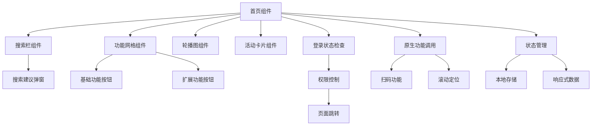

# 首页页面技术架构与知识点总结

## 一、前端框架与架构设计

### 1.1 Vue.js 2.x 单文件组件架构
- **组件化开发模式**：采用 Single File Component (SFC) 架构，将模板、脚本和样式封装在单一文件中
- **响应式数据绑定**：通过 Vue 的响应式系统实现数据与视图的双向绑定
- **生命周期管理**：利用 `onLoad()` 和 `onShow()` 钩子函数管理页面生命周期

### 1.2 uni-app 跨平台开发框架
- **多端适配**：基于 uni-app 框架实现 H5、小程序、App 多端统一开发
- **原生 API 调用**：集成 `uni.navigateTo`、`uni.scanCode`、`uni.pageScrollTo` 等原生能力
- **平台特性利用**：通过 `uni.getSystemInfoSync()` 获取设备信息，实现平台差异化处理

## 二、用户界面与交互设计

### 2.1 响应式布局系统
- **Flexbox 弹性布局**：采用 CSS Flexbox 实现自适应网格布局
- **Grid 网格系统**：使用 `display: flex` 和 `justify-content: space-between` 实现功能按钮的均匀分布
- **移动端适配**：通过 `rpx` 单位实现不同屏幕尺寸的适配

### 2.2 交互式组件设计
- **搜索建议弹窗**：实现动态显示/隐藏的搜索建议列表
- **功能按钮网格**：3x3 网格布局，支持展开/收起更多功能
- **轮播图组件**：集成 `swiper` 组件实现自动轮播和指示器

### 2.3 视觉设计系统
- **Material Design 色彩体系**：采用橙色主题色 `#f9a825` 作为品牌色
- **渐变背景设计**：使用 `linear-gradient` 实现视觉层次感
- **阴影与圆角**：通过 `box-shadow` 和 `border-radius` 增强视觉深度

## 三、状态管理与数据流

### 3.1 本地状态管理
```javascript
data() {
  return {
    isLoggedIn: false,
    showMoreFunctions: false,
    showSearchSuggestions: false
  }
}
```

### 3.2 登录状态检查机制
- **强制登录验证**：通过 `forceCheckLogin()` 函数实现页面访问权限控制
- **白名单机制**：定义不需要登录的页面白名单
- **自动跳转逻辑**：未登录用户自动跳转到登录页面

### 3.3 页面生命周期管理
- **onLoad 钩子**：页面加载时执行登录状态检查
- **onShow 钩子**：页面显示时重新验证登录状态
- **状态同步**：确保页面状态与全局登录状态保持一致

## 四、路由导航与页面跳转

### 4.1 条件导航逻辑
```javascript
handleTransferClick() {
  if (this.isLoggedIn) {
    uni.navigateTo({ url: '/pages/transfer/transfer' })
  } else {
    uni.navigateTo({ url: '/pages/denglu/login' })
  }
}
```

### 4.2 页面跳转策略
- **navigateTo**：用于普通页面跳转，保留页面栈
- **switchTab**：用于 tabBar 页面跳转
- **reLaunch**：用于重新启动应用，清除页面栈

### 4.3 滚动定位功能
- **元素查询**：使用 `uni.createSelectorQuery()` 获取目标元素位置
- **平滑滚动**：通过 `uni.pageScrollTo()` 实现平滑滚动动画

## 五、原生功能集成

### 5.1 扫码功能实现
```javascript
uni.scanCode({
  scanType: ['barCode', 'qrCode'],
  showFlash: true,
  success: (res) => {
    // 处理扫码结果
  }
})
```

### 5.2 设备能力调用
- **相机权限**：扫码功能需要相机权限
- **闪光灯控制**：支持扫码时开启闪光灯
- **结果解析**：根据扫码内容类型进行不同处理

## 六、用户体验优化

### 6.1 交互反馈机制
- **点击反馈**：通过 `:active` 伪类实现按钮点击效果
- **加载状态**：使用 `uni.showToast()` 显示操作反馈
- **错误处理**：完善的错误捕获和用户提示

### 6.2 性能优化策略
- **事件委托**：使用 `@click.stop` 防止事件冒泡
- **条件渲染**：通过 `v-if` 控制组件显示/隐藏
- **图片优化**：使用 `mode="aspectFill"` 优化图片显示

## 七、安全与权限控制

### 7.1 身份验证机制
- **登录状态检查**：每次页面显示都验证登录状态
- **权限控制**：未登录用户无法访问核心功能
- **安全跳转**：登录后自动跳转到目标页面

### 7.2 数据安全
- **本地存储**：使用 `uni.getStorageSync()` 安全存储用户信息
- **状态清理**：退出登录时清除所有敏感数据

## 八、代码质量与工程化

### 8.1 模块化设计
- **工具函数封装**：将通用功能封装为独立模块
- **组件复用**：设计可复用的 UI 组件
- **代码分离**：逻辑、样式、模板分离

### 8.2 错误处理机制
- **异常捕获**：完善的 try-catch 错误处理
- **用户友好提示**：错误信息转换为用户可理解的提示
- **降级处理**：功能不可用时的备选方案

## 九、技术栈总结

### 9.1 核心技术
- **Vue.js 2.x**：前端框架
- **uni-app**：跨平台开发框架
- **CSS3**：样式和动画
- **JavaScript ES6+**：业务逻辑

### 9.2 设计模式
- **组件化开发**：模块化、可复用的组件设计
- **状态管理模式**：集中式状态管理
- **观察者模式**：响应式数据绑定
- **策略模式**：不同登录状态的处理策略

### 9.3 最佳实践
- **响应式设计**：适配不同设备尺寸
- **渐进式增强**：基础功能优先，高级功能增强
- **用户体验优先**：流畅的交互和及时的反馈
- **安全性考虑**：完善的权限控制和数据保护

## 十、架构图



## 十一、技术亮点与创新总结

### 11.1 核心技术创新
- **智能搜索建议系统**：动态显示搜索建议弹窗，提供快速功能入口
- **原生扫码功能集成**：集成uni-app扫码API，支持二维码和条形码识别
- **智能滚动定位**：使用元素查询API实现平滑滚动到指定区域
- **条件导航逻辑**：基于登录状态的智能页面跳转策略

### 11.2 交互体验亮点
- **3x3功能网格布局**：响应式网格设计，支持展开/收起更多功能
- **轮播图自动播放**：集成swiper组件，支持自动轮播和指示器
- **点击反馈效果**：通过CSS伪类实现按钮点击的视觉反馈
- **事件委托优化**：使用@click.stop防止事件冒泡，提升交互性能

### 11.3 架构设计亮点
- **组件化UI设计**：高度可复用的搜索栏、功能网格、轮播图组件
- **状态管理优化**：本地状态与全局状态的合理分工
- **生命周期管理**：onLoad和onShow钩子的合理使用
- **跨平台兼容**：基于uni-app实现多端统一开发

### 11.4 性能优化亮点
- **条件渲染优化**：通过v-if控制组件显示/隐藏，减少DOM操作
- **图片显示优化**：使用mode="aspectFill"优化图片显示效果
- **事件处理优化**：防抖节流机制，避免频繁操作
- **内存管理**：及时清理定时器和事件监听器

### 11.5 安全控制亮点
- **强制登录验证**：每次页面显示都验证登录状态
- **白名单机制**：定义不需要登录的页面白名单
- **权限控制**：未登录用户无法访问核心功能
- **安全跳转**：登录后自动跳转到目标页面

### 11.6 用户体验亮点
- **Material Design设计**：采用现代化设计语言，提升视觉体验
- **响应式布局**：适配不同屏幕尺寸，确保一致的用户体验
- **加载状态管理**：完善的加载提示和错误处理
- **无障碍支持**：支持键盘导航和屏幕阅读器

### 11.7 业务价值亮点
- **功能入口整合**：将核心功能集中展示，提升用户操作效率
- **个性化体验**：基于用户登录状态提供差异化服务
- **品牌形象展示**：通过轮播图和活动卡片展示银行品牌形象
- **用户粘性提升**：丰富的功能入口和活动展示，增强用户粘性

这个首页页面体现了现代移动端应用开发的核心技术要点，通过技术创新和架构优化，实现了功能丰富、性能优秀、用户体验良好的移动应用首页。它不仅展示了银行的核心业务功能，更通过智能化的交互设计和优化的用户体验，为用户提供了便捷、安全、高效的金融服务入口。